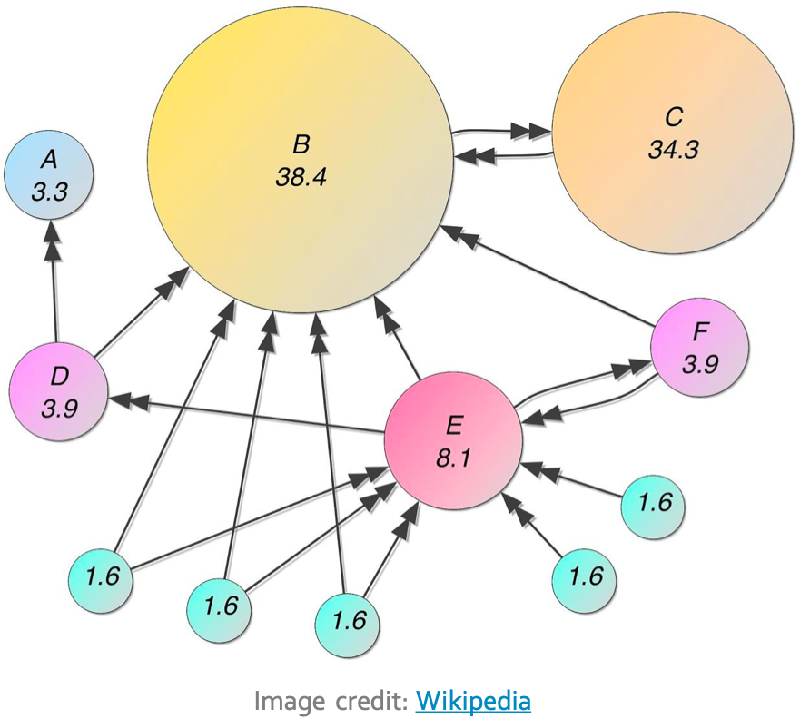

# GooglePageRank

 This project showcases the famous Google Page Rank algorithm developed by Larry Page and Sergey Brin. The implementation uses only numpy for matrix vector calculations and networkx for graph representation purposes.

 The PageRank is based on  taken from Wikipedia. I had to first generate the adjacency matrix manually and then the whole algorithm was applied on it. 

